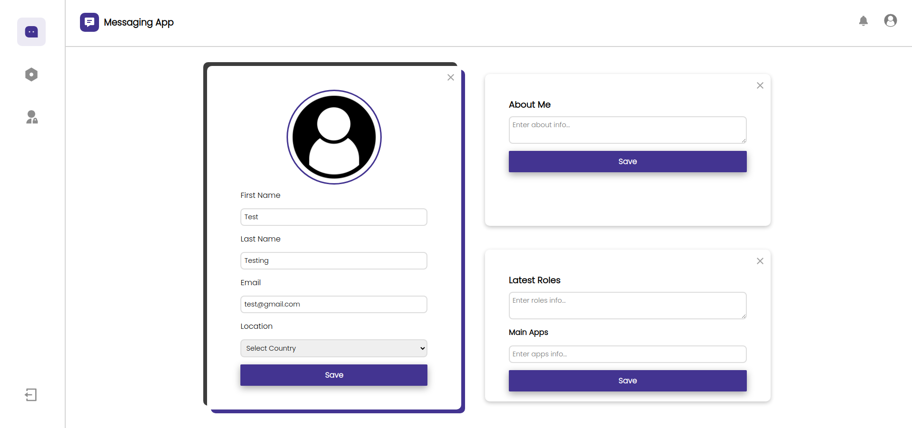

# Messaging App

🔗 [View Demo](https://messaging-app-2mr0.onrender.com/)

## Table of Contents
- [About The Project](#about-the-project)
- [Built With](#built-with)
- [Screenshots](#screenshots)
- [Features](#features)

## About The Project
A Messaging Application that primarily allows you to chat with other users.

## Screenshots

### Initial Screen
 

### Sign Up Form

### Chat Page

### User Profile

### User Profile (Editing)

[Back to Top](#messaging-app)

## Built With

---

🔏 **Passport.js**

🔑 **Bcrypt**

[Back to Top](#messaging-app)

## Features

- Log In & Sign Up Forms
- Demo Account
- Form Validation
- Authorization and Authentication
- Chat Section Displays All Users Signed Up
- Send Messages to Other Users
- Send Emojis in Chat
- Notification System
- Customise User Profile
- Responsive User Interface

[Back to Top](#messaging-app)
